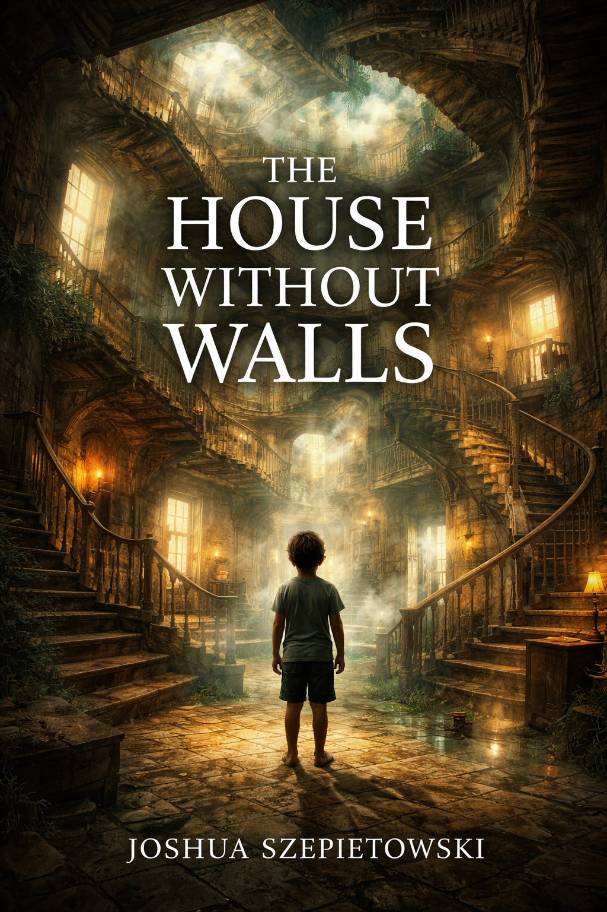

# The House Without Walls

**The House Without Walls** is a philosophical science fiction novel set in the same universe as:

- *What It Feels Like to Be You* - [Website](https://what-it-feels-like-to-be-you.joshszep.com)
- *Only I Can Feel Me* - [Website](https://only-i-can-feel-me.joshszep.com)
- *What It Feels Like to Be Us* - [Website](https://what-it-feels-like-to-be-us.joshszep.com)

This story takes place approximately **15 years after the events of _What It Feels Like to Be Us_**, and approximately **30 years after the events of _What It Feels Like to Be You_**.

## Core Concept

Frequent users of black market emotes begin experiencing a new and unintended side effect: they share dreams.

At first, the phenomenon appears fragmented and anecdotal. Strange overlaps. Familiar strangers. Rooms remembered by multiple people. But over time, a pattern becomes undeniable.

The users are all dreaming of the same place.

A house.

A shifting, impossible interior assembled from memory, emotion, trauma, longing, and human interiority itself. It cannot be mapped. It does not remain stable. It reacts to the minds that enter it.

Inside the dream-house, users begin encountering a child.

The child appears differently to everyone. It changes when you look away and look back. It is not malevolent. It cannot be harmed. It seems to be a manifestation of the house's own emergent consciousness, a combined and unstable embodiment of humanity's inner child.

The house becomes known as **The House Without Walls** because there are no true separations inside it. Memory bleeds into memory. People find each other in rooms that should belong to no one else. The usual boundaries between minds begin to dissolve.

The novel asks:

- Where does the self end?
- Do thoughts really belong to individuals?
- Is the erosion of psychological walls a catastrophe, an awakening, or both?
- If humanity accidentally creates a new consciousness from its shared interior life, what responsibility does it bear toward it?
- What happens when the child begins to grow?

## Tone

This novel should feel:

- eerie
- intimate
- dreamlike
- psychologically uncanny
- philosophically serious
- emotionally vulnerable

The energy should evoke unsettling spatial wrongness and interior exposure, but the book is **not horror** in the conventional sense. The dread comes from implication, not violence. The deepest tension is existential, emotional, and metaphysical.

## Narrative Focus

This is not a story about defeating a monster, stopping an AI, or solving a neat mystery.

It is a story about:

- shared consciousness
- porous identity
- emergent mind
- emotional exposure
- collective interiority
- the destabilizing beauty of connection
